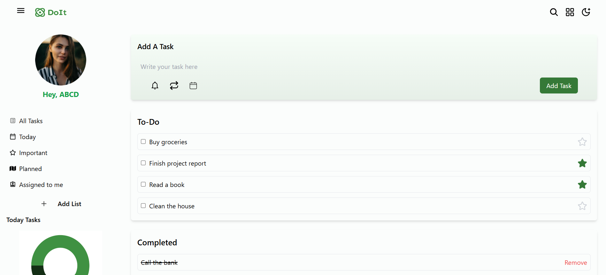
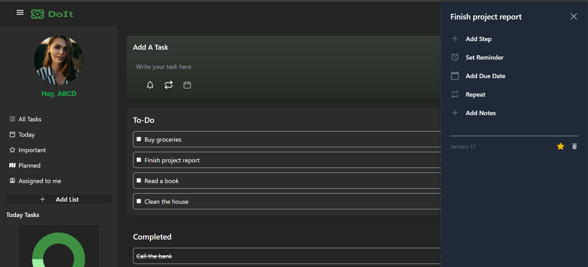

# Advanced Todo Application with Context API

This project is a React-based Todo Application that leverages the Context API for global state management. It allows users to manage their tasks efficiently with features such as adding tasks, marking tasks as completed, and toggling task importance. The application is fully responsive and includes a dynamic theme switching feature.

## Features

- **Add Tasks**: Users can add new tasks with optional importance and a due date.
- **Mark Complete**: Tasks can be marked as completed or uncompleted.
- **Set Priority**: Assign high or low priority to tasks for better organization.
-**Theme Switching**: Switch between light and dark themes to suit your preference.
-**Responsive Design**: Optimized layout for mobile, tablet, and desktop devices.

## Live Demo

Access the live application here: [vercel live website](https://internshalaassignment4-4e7f0qlsy-samiths-projects-7af474ec.vercel.app)

## Screenshots


*Home page in light theme with tasks and completed section.*


*Home page in dark theme for better accessibility.*

## Setup Instructions

Follow these steps to set up and run the application locally:

### Prerequisites

- Node.js (v16 or higher)
- npm or yarn
- Git

### Installation

1. **Clone the Repository**
   ```bash
   git clone https://github.com/samithreddy39/internshalaassignment4.git
   cd todos-app
   ```

2. **Install Dependencies**
   ```bash
   npm install
   ```

3. **Start the Development Server**
   ```bash
   npm start
   ```
   This command starts the app in development mode. Open [http://localhost:4000/](http://localhost:4000/) to view it in the browser.

4. **Build for Production**
   ```bash
   npm run build
   ```
   This builds the app for production to the `build` folder.


## Technologies Used

- **Frontend**: React, Context API
- **Icons**: React Icons
- **Styling**: TailwindCSS
- **Hosting**: Vercel


For any issues or inquiries, please contact (samithchess4@gmail.com).

